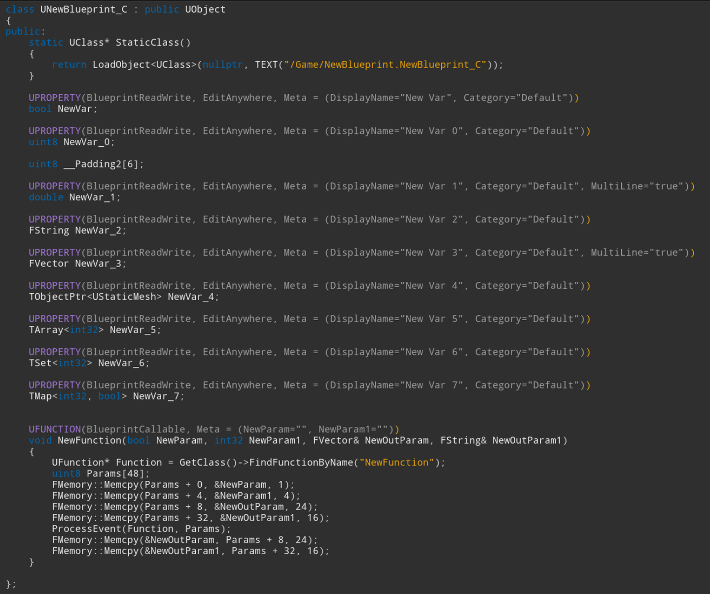
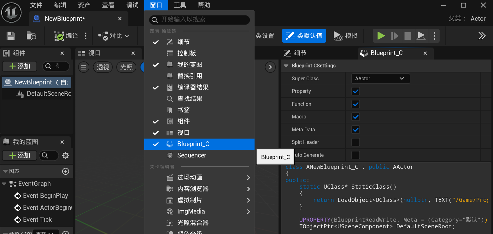
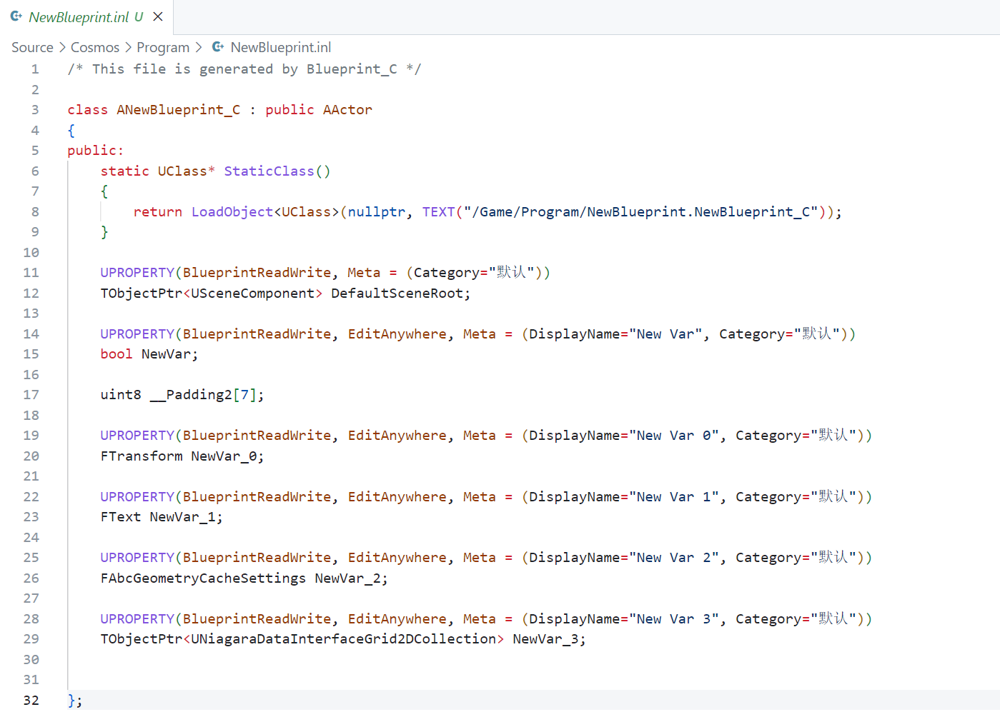

# Blueprint_C
**Blueprint_C** 是一个虚幻引擎插件，使用它可以生成蓝图结构的C++代码代理，以便C++能轻易地读写蓝图属性和调用蓝图方法：



## 使用说明

在蓝图编辑器标题栏的 `Window` 菜单下可以打开 `Blueprint_C` 的面板：



面板中可调参数的作用如下：

- **Super Class**：导出代码所使用的父类
- **Property**：是否导出属性
- **Function**：是否导出函数
- **Macro**：是否生成UHT宏
- **Meta Data**：是否在UHT宏中显示元数据
- **Split Header**：是否将代码分割为头文件和源文件
- **Auto Generate** ： 是否自动生成代码文件到源码工程中

在蓝图编辑器中执行编译会自动刷新生成代码。

生成的类定义在内存结构上与蓝图类保持一致，将生成的代码拷贝到工程代码中，就可以在C++中这样去操作蓝图对象：

``` c++
// Cast
//UClass* Class = LoadObject<UClass>(nullptr, TEXT("/Game/NewBlueprint.NewBlueprint_C"));
//UObject* Object = NewObject<UObject>(GetTransientPackage(), Class);
//UNewBlueprint_C* NewBlueprintObj = Cast<UNewBlueprint_C>(Object);

// New Object
UNewBlueprint_C* NewBlueprintObj = NewObject<UNewBlueprint_C>();

// Read Write Property
NewBlueprintObj->NewVar_0;
NewBlueprintObj->NewVar_1 = 2.0f;

// Call Function
FVector OutParam1;
FString OutParam2;
NewBlueprintObj->NewFunction(true, 0, OutParam1, OutParam2);
```

### 自动生成

勾选了 **Auto Generate** 的蓝图，会在编译保存时，将自动生成一个 `*.inl`代码文件到项目源码目录相同的文件结构下



你只需要在C++代码中包含即可使用：
``` c++
#include "..."     // some header files for dependencies
#include "NewBlueprint.inl"
```

如果需要修改导出目录的规则，请修改如下函数的实现：

- `void FBlueprint_C::TryAutoGenerate(UBlueprint* InBlueprint, TPair<FString, FString> Code)`
